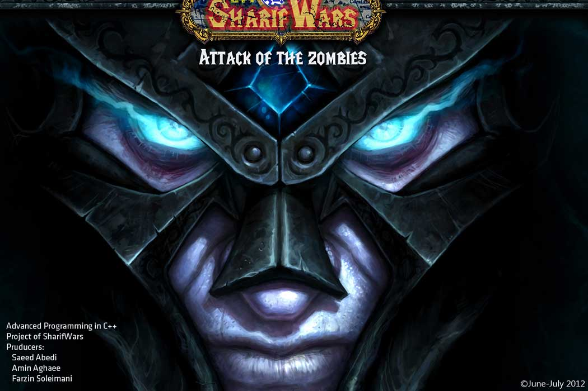

# SharifWars

Sharif Wars is real-time strategy games, where players play as their characters and gain experience to level up based on [Warcraft](https://worldofwarcraft.com) game series. The logic base of the program is written in C++ and a graphical layer using Qt framework was added to Attack of the zombies version.
This repository is result of a final course project of Advanced Machine Learning in C++ at Sharif University of Technology. 

